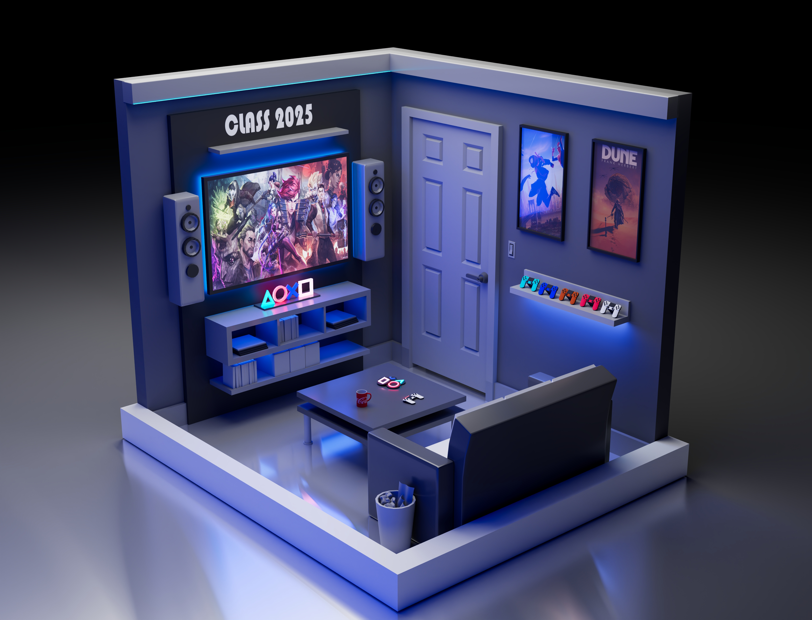
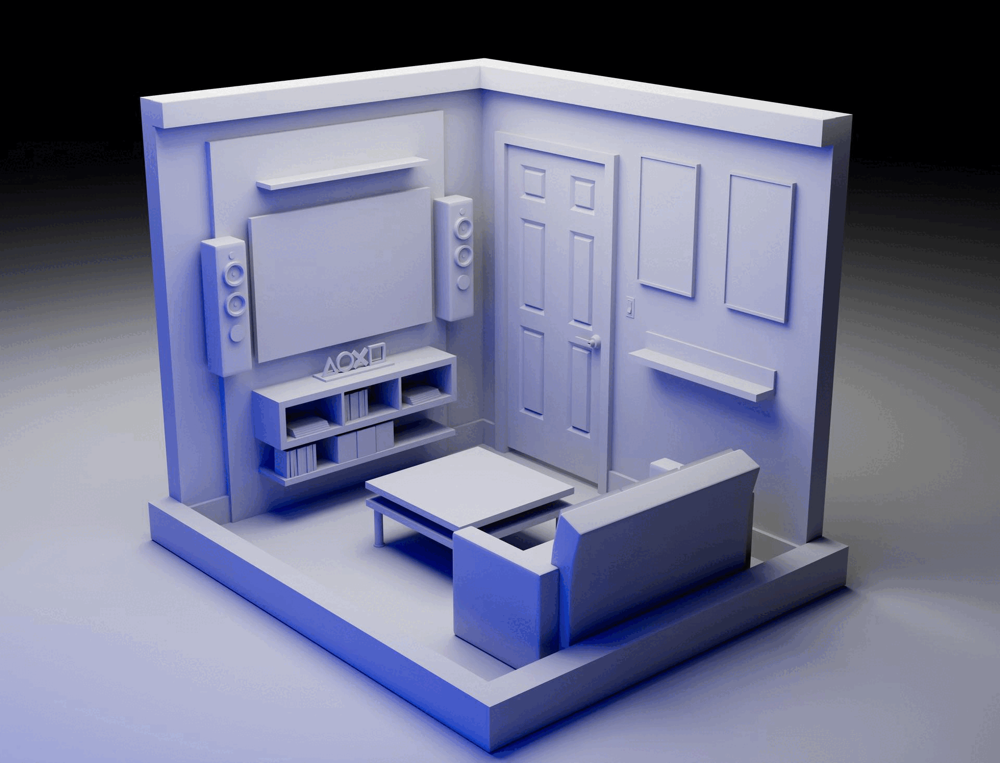
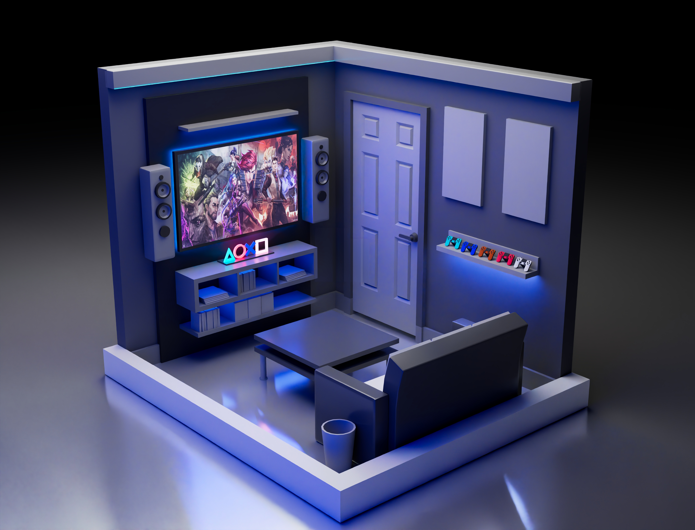
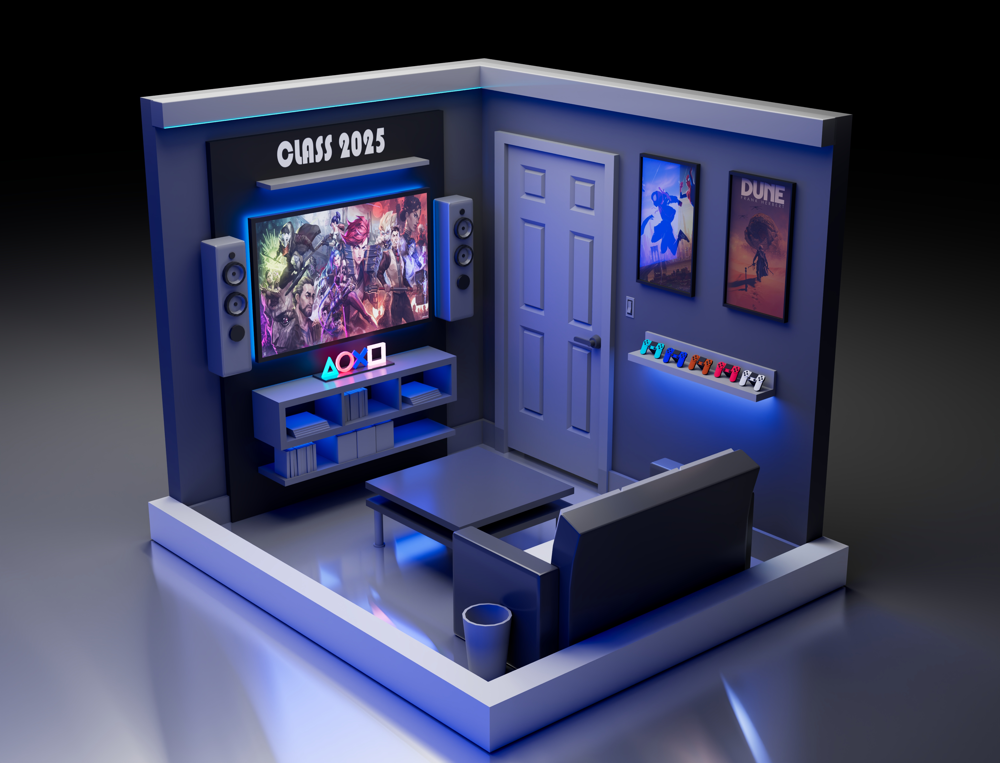

# Title:
### A Sci-fi 3D Modeling Room
|Final Render|
|:-:|
||

# Description:
### This is a 3D modeling class environment project. All the models were done in Autodesk Maya 2025.
### I Used a cold blue area light to light up the room first, 
### then used two area lights as "manual" globle illumination lights.
### The rest of the lights were illuminated by shaders emmision.

# Details:
|Progressive|
|:-:|
||

|Models|
|:-:|
||

|Day1|
|:-:|
||

|Day2|
|:-:|
||

|Day3|
|:-:|
||

# Reference:
- https://www.artstation.com/artwork/VdBllN     by Jarlan Perez
- https://www.artstation.com/artwork/YKeR96     by mist XG
- Spiderman wall paper
- Dune movie poster
